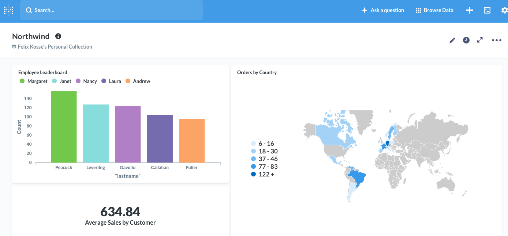
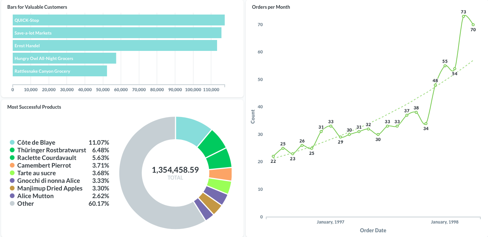
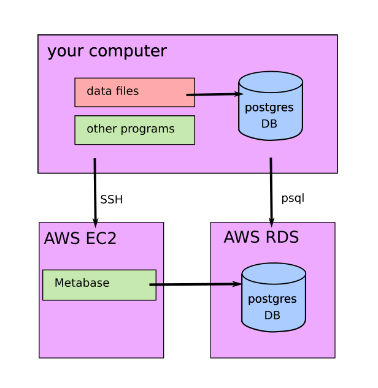

# Company Dashboard

 

In this project, I built a dashboard summarizing the Northwind Database. It is a sample database that is shipped along with Microsoft Access. The data is about “Northwind Traders”, a fictional company. The database contains all sales transactions between the company and its customers as well as purchases from Northwinds suppliers. The data is available [here](https://github.com/pawlodkowski/northwind_data_clean).

## Steps to Create the Databse and Dashboard
- installing PostgreSQL
- creating one table in the database per CSV file
- loading the data into the database
- creating foreign keys to connect the tables
- answering questions on the data in SQL
- uploading the data to a AWS RDS cloud database
- building an interactive dashboard with Metabase 
- hosting the dashboard on an AWS EC2 cloud server

## Information
The dashboard shows many pieces of key information such as:
- leaderboard for employee performance, 
- a world map that shows the orders by country, 
- valuable customers, 
- most ordered products,
- number of total orders over the last two years

