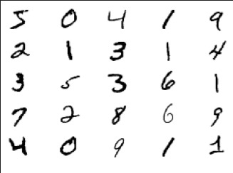
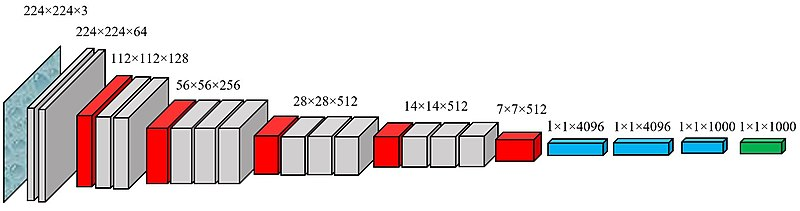

# Deep Learning and Image Recognition 
Building an Artificial Neural Network to recognize handwritten digits from the [MNIST](http://yann.lecun.com/exdb/mnist/ 'go ot page') dataset.

* building a neural network from scratch
* creating a virtual environment for my project
* training a neural network with Keras
* choosing hyperparameters of a neural network
* plotting a learning curve
* training a Convolutional Neural Network
* using a pretrained network on photographs

### Business Problem:

Assume you want to sort 100 million letters with a handwritten postal code per year.
Assume that the sorting machine will achieve your test accuracy for each of five digits in the code.

What is the probability of a postal code assigned correctly?

If sorting an unrecognized letter manually costs 10 cent, what will be the impact of improving the accuracy by 0.1%?

Numbers for reference: the new DHL logistic centre in Bochum is processing up to 50000 parcels per hour. On peak days 11 million per day. Of course, most of these don’t have handwritten digits, but it illustrates the size of the task.

### Buidling a Convolutional Neural Network

image from [everybodywiki](https://en.everybodywiki.com/VGG_Net 'go to page') (CC BY-SA 3.0)
