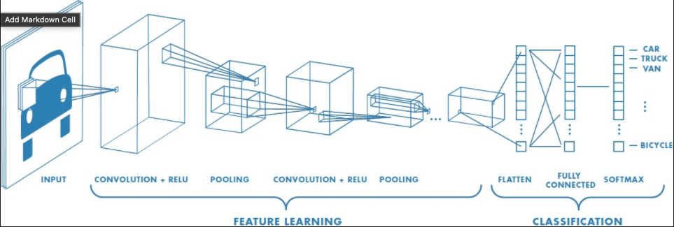
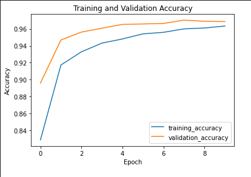
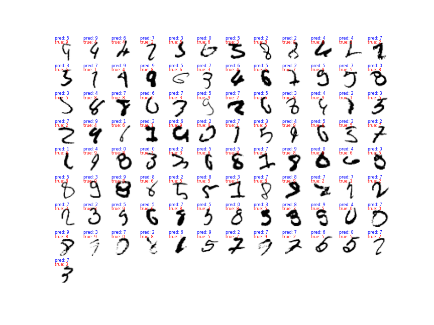

# Deep Learning and Image Recognition 
Building an Artificial Neural Network to recognize handwritten digits from the [MNIST](http://yann.lecun.com/exdb/mnist/ 'go ot page') dataset with an accuracy of 99.03% on the Test-set.

* building a neural network from scratch
* creating a virtual environment for my project
* training a neural network with Keras
* choosing hyperparameters of a neural network
* plotting a learning curve
* training a Convolutional Neural Network
* using a pretrained network on photographs

### Business Problem:

Assume you want to sort 100 million letters with a handwritten postal code per year.
Assume that the sorting machine will achieve your test accuracy for each of five digits in the code.

What is the probability of a postal code assigned correctly?

If sorting an unrecognized letter manually costs 10 cent, what will be the impact of improving the accuracy by 0.1%?

Numbers for reference: the new DHL logistic centre in Bochum is processing up to 50000 parcels per hour. On peak days 11 million per day. Of course, most of these don’t have handwritten digits, but it illustrates the size of the task.

### Buidling a Convolutional Neural Network
CNNs are biologically-inspired models inspired by research by D. H. Hubel and T. N. Wiesel. They proposed an explanation for the way in which mammals visually perceive the world around them using a layered architecture of neurons in the brain, and this in turn inspired engineers to attempt to develop similar pattern recognition mechanisms in computer vision.

Thus deep convolutional neural networks (CNN) are designed with the following elements, which were inspired by nature:

Illustration of the CNN model achitecture by [mathworks](https://www.mathworks.com/content/mathworks/www/en/discovery/convolutional-neural-network/jcr:content/mainParsys/image_copy.adapt.full.high.jpg/1497876372993.jpg 'go to page')

### Evaluating the Model

Plotting the Learning Curve 

Investigating the Model Output

