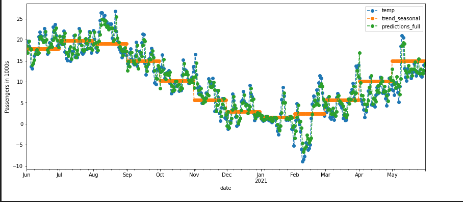
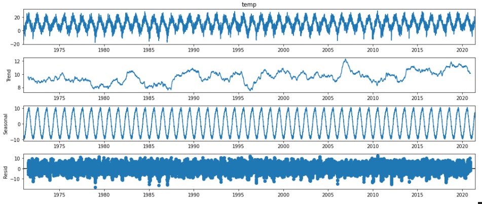
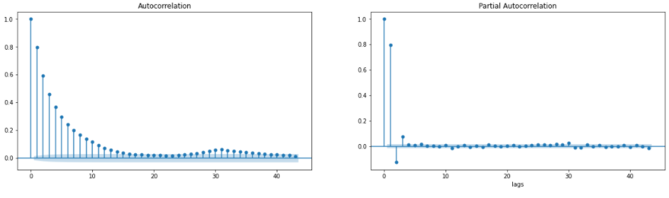

## Short-term Temperature Forecast for Berlin Dahlem
* Getting and cleaning temperature data from [www.ecad.eu](https://www.ecad.eu 'go to page')
* Building a baseline model modelling trend and seasonality
* Plotting and inspecting the different components of a time series
* Modeling time dependence of the remainder using an AutoRegression model
* Comparing the statistical output of different AutoRegression models
* Testing the remainder for stationarity using the Dickey-Fuller Test
* Determining the number of lags by employing the Box-Jenkins Methodology
* Forecasting the next day's temperature with and accuracy of 97.86% 

Comparing the different parts of the model

Decomposing the Time Series

Employing the Autocorrelation Function and Partial Autocorrelation Function according to Box-Jenkins Methodology
