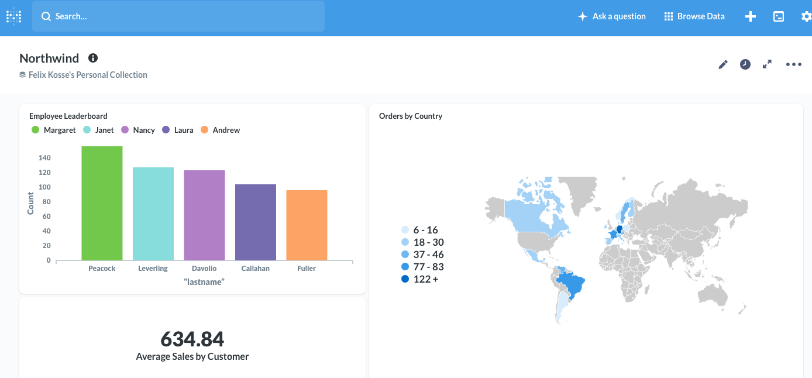
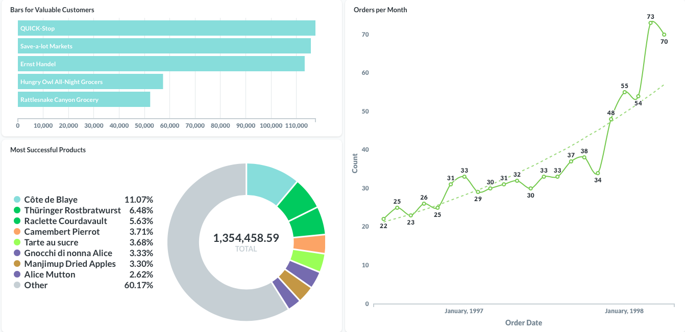

# Company Dashboard

This is a dashboard for the constructed company Northwind Trading.

The data was extracted from multiple tables with the help of Sql-queries and Metabase. The date is displayed as graphs to increase the readability.

It shows many pieces of key information such as a leaderboard for employee performance a world map that shows the orders by country.

----

...most valuable customers, most ordered products and number of total orders over the last two years.

